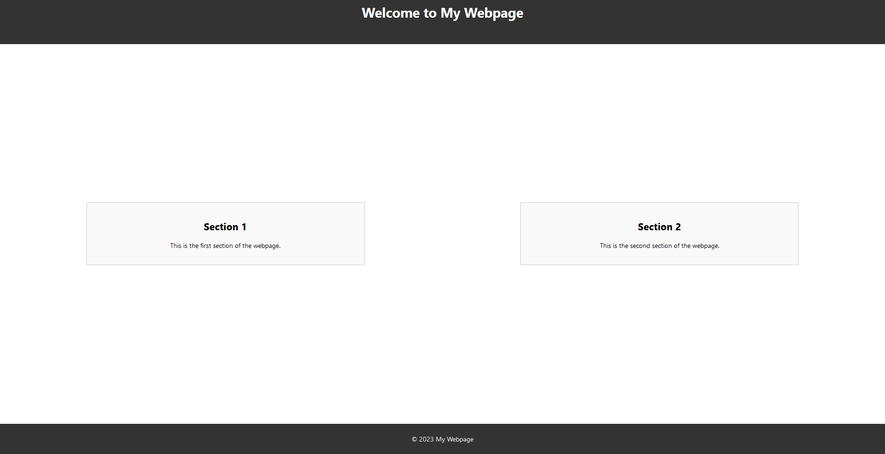

## Overview

In this task, you'll create a basic React application to display a single webpage with multiple sections.

Each section of the webpage will be a separate component.

The webpage must have the following components:
`App`, `Header`, `MainContent` & `Footer`.

## Requirements

- The `App` component should contain the other required components inside of it.

- The `Header` component can be a simple `h1` element.

- The `MainContent` component should have two `section` elements.

- The `Footer` component can be a simple `footer` element.

- You can style the website to your liking using the `index.css` file.

Here's How the website can look:

## Getting Started

1.  Fork this repository to your GitHub account.

2.  Clone the repository to your local development environment.

3.  Create the required components - `App`, `Header`, `MainContent` & `Footer`.

4.  Add basic styling to your app.

5.  Test your application to ensure that the components are rendered correctly.

6.  Commit your code and push it to your GitHub repository.

## Submission

Once you've completed the task, create a pull request for this repo.
